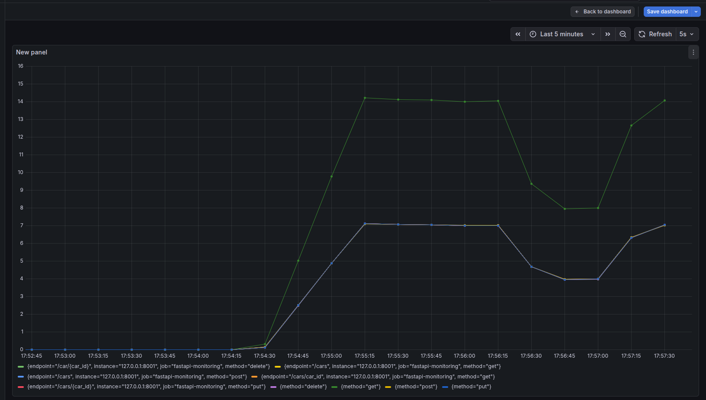
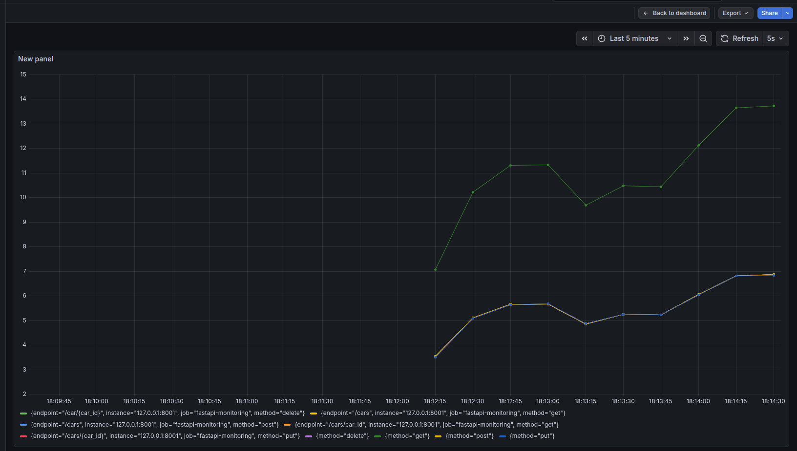

# FastAPI Observability with Prometheus & Grafana

This project demonstrates how to monitor a FastAPI application using Prometheus and visualize metrics with Grafana.

## Stack


- Python
- FastAPI
- Prometheus
- Grafana
- Bash (traffic generator)

## Features
- HTTP request metrics
- Method based traffic

## Dashboard Preview



## How it works

FastAPI exposes metrics at `/metrics` using prometheus-fastapi-instrumentator.  
Prometheus scrapes the metrics and stores them.  
Grafana uses Prometheus as a datasource and visualizes the data.

## Run Locally
```bash
pip install -r requirements.txt
uvicorn main:app --reload
prometheus --config.file=prometheus.yml
grafana-server
bash scripts/traffic.sh

## 📄 License

This project is licensed under the MIT License - see the [LICENSE](LICENSE) file for details.

## 👤 Author

**Aman Dabral**

- GitHub: [@amandev-x](https://github.com/amandev-x)
- Project Link: [Fastapi-simple-monitoring](https://github.com/amandev-x/Fastapi-simple-monitoring)

## 🙏 Acknowledgments

- Fastapi to build simple API
- Prometheus for system metrics
- Grafana for Visualization
- Bash for simple script to generate traffic
- The open-source community

⭐ **If you found this project helpful, please give it a star!** ⭐
